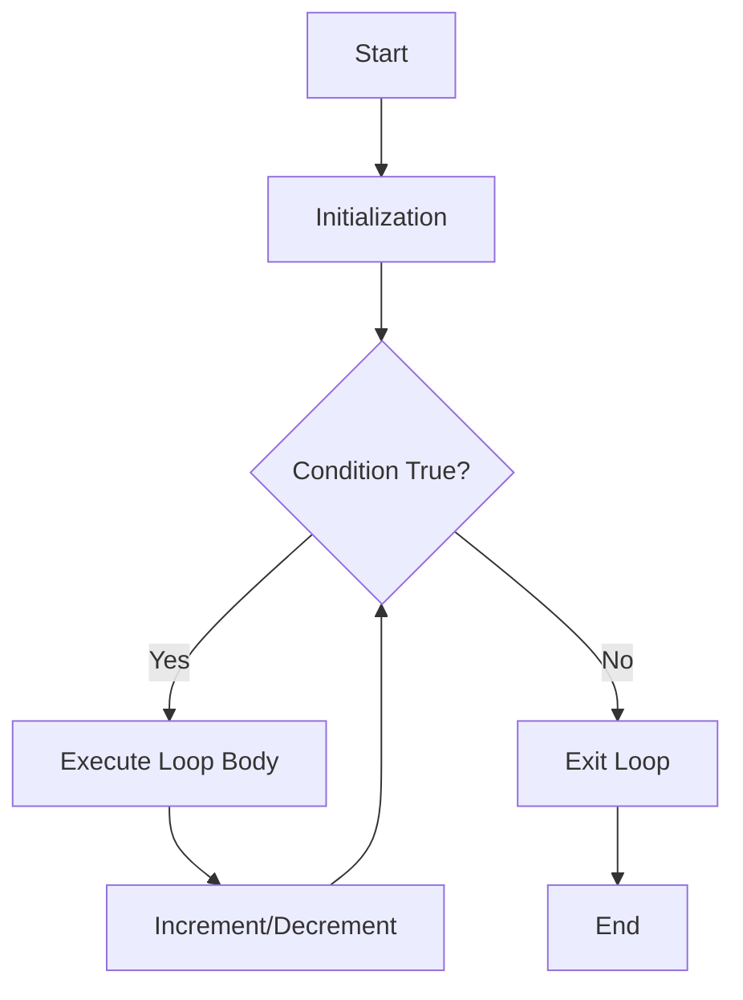
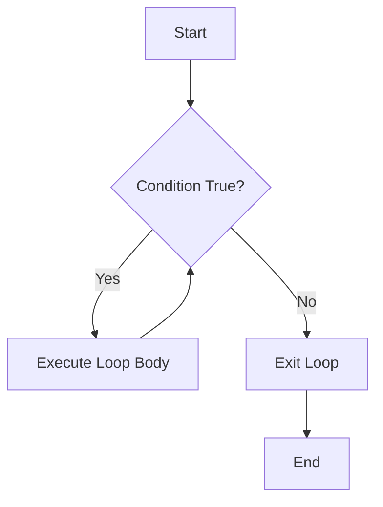
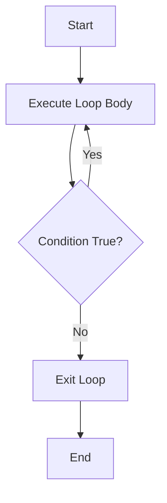
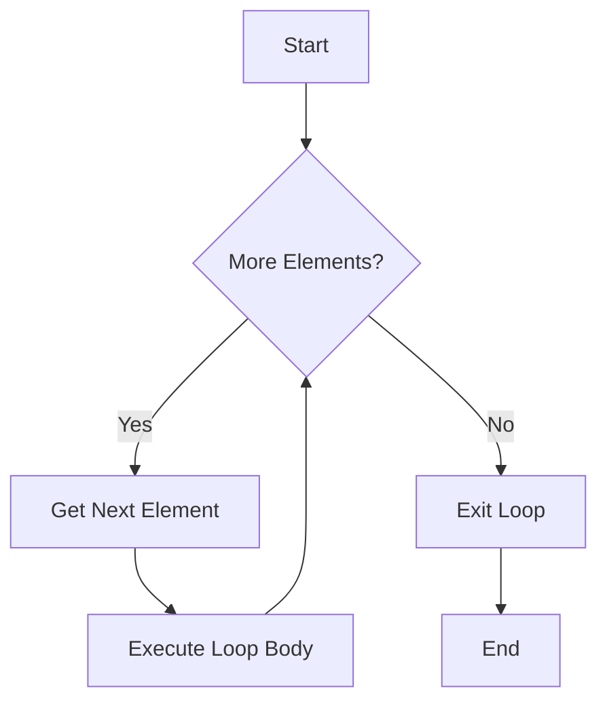

# Loops in Java: A Comprehensive Guide

## Introduction

**Loops** are fundamental control structures in Java that allow you to execute a block of code repeatedly based on a condition. Instead of writing the same code multiple times, loops help you automate repetitive tasks efficiently.

### Why Use Loops?

- **Iteration**: Process each element in a collection (arrays, lists)
- **Repetition**: Perform an action multiple times (printing, calculations)
- **Pattern Generation**: Create visual patterns, number sequences
- **Data Processing**: Read files, parse data, handle user input
- **Algorithm Implementation**: Search, sort, and manipulate data structures

### Real-World Use Cases

- Processing database records
- Validating user input until correct
- Generating reports from datasets
- Rendering UI elements dynamically
- Processing sensor data in IoT applications

---

## Types of Loops in Java

Java provides four main types of loops:

1. **for loop** - When you know the number of iterations
2. **while loop** - When iterations depend on a condition
3. **do-while loop** - When you need at least one execution
4. **enhanced for-each loop** - For iterating over collections/arrays

---

## 1. The `for` Loop

### Syntax
```java
for (initialization; condition; increment/decrement) {
    // loop body
}
```

### Flow Explanation

1. **Initialization**: Executed once at the beginning
2. **Condition**: Checked before each iteration
3. **Loop Body**: Executed if condition is true
4. **Increment/Decrement**: Executed after each iteration
5. **Repeat**: Steps 2-4 repeat until condition becomes false

### Mermaid Flowchart


### Code Examples

**Simple Example: Printing Numbers**
```java
public class ForLoopExample {
    public static void main(String[] args) {
        // Print numbers from 1 to 5
        for (int i = 1; i <= 5; i++) {
            System.out.println(i);
        }
    }
}
```

**Output:**
```
1
2
3
4
5
```

**Realistic Example: Array Processing**
```java
public class ArraySum {
    public static void main(String[] args) {
        int[] numbers = {10, 20, 30, 40, 50};
        int sum = 0;
        
        for (int i = 0; i < numbers.length; i++) {
            sum += numbers[i];
        }
        
        System.out.println("Sum: " + sum); // Output: Sum: 150
    }
}
```

### Common Mistakes

❌ **Off-by-one errors**
```java
// Wrong: Won't process last element
for (int i = 0; i < array.length - 1; i++) { }
```

❌ **Infinite loops due to wrong increment**
```java
// Wrong: i never increases
for (int i = 0; i < 10; i--) { }
```

❌ **Modifying loop variable inside body**
```java
// Confusing and error-prone
for (int i = 0; i < 10; i++) {
    i++; // Don't do this!
}
```

---

## 2. The `while` Loop

### Syntax
```java
while (condition) {
    // loop body
}
```

### Flow Explanation

1. **Condition Check**: Evaluated before each iteration
2. **Loop Body**: Executed only if condition is true
3. **Repeat**: Steps 1-2 continue until condition becomes false

**Note**: If the condition is false initially, the loop body never executes.

### Mermaid Flowchart


### Code Examples

**Simple Example: Countdown**
```java
public class WhileLoopExample {
    public static void main(String[] args) {
        int count = 5;
        
        while (count > 0) {
            System.out.println(count);
            count--;
        }
        System.out.println("Liftoff!");
    }
}
```

**Output:**
```
5
4
3
2
1
Liftoff!
```

**Realistic Example: User Input Validation**
```java
import java.util.Scanner;

public class InputValidation {
    public static void main(String[] args) {
        Scanner scanner = new Scanner(System.in);
        int number = -1;
        
        while (number < 0 || number > 100) {
            System.out.print("Enter a number between 0 and 100: ");
            number = scanner.nextInt();
            
            if (number < 0 || number > 100) {
                System.out.println("Invalid input! Try again.");
            }
        }
        
        System.out.println("Valid number entered: " + number);
        scanner.close();
    }
}
```

### Common Mistakes

❌ **Forgetting to update the condition variable**
```java
// Infinite loop!
int i = 0;
while (i < 10) {
    System.out.println(i);
    // Missing: i++;
}
```

❌ **Wrong condition logic**
```java
// Will never execute
int x = 10;
while (x < 5) {
    System.out.println(x);
}
```

---

## 3. The `do-while` Loop

### Syntax
```java
do {
    // loop body
} while (condition);
```

### Flow Explanation

1. **Execute Loop Body**: Runs at least once before checking condition
2. **Condition Check**: Evaluated after each iteration
3. **Repeat**: If condition is true, execute body again

**Key Difference**: Guarantees at least one execution, even if condition is false.

### Mermaid Flowchart


### Code Examples

**Simple Example: Menu System**
```java
import java.util.Scanner;

public class DoWhileExample {
    public static void main(String[] args) {
        Scanner scanner = new Scanner(System.in);
        int choice;
        
        do {
            System.out.println("\n--- Menu ---");
            System.out.println("1. Option A");
            System.out.println("2. Option B");
            System.out.println("3. Exit");
            System.out.print("Enter choice: ");
            choice = scanner.nextInt();
            
            switch (choice) {
                case 1:
                    System.out.println("You selected Option A");
                    break;
                case 2:
                    System.out.println("You selected Option B");
                    break;
                case 3:
                    System.out.println("Goodbye!");
                    break;
                default:
                    System.out.println("Invalid choice!");
            }
        } while (choice != 3);
        
        scanner.close();
    }
}
```

**Realistic Example: Password Verification**
```java
import java.util.Scanner;

public class PasswordCheck {
    public static void main(String[] args) {
        Scanner scanner = new Scanner(System.in);
        String password;
        final String CORRECT_PASSWORD = "Java123";
        
        do {
            System.out.print("Enter password: ");
            password = scanner.nextLine();
            
            if (!password.equals(CORRECT_PASSWORD)) {
                System.out.println("Incorrect! Try again.");
            }
        } while (!password.equals(CORRECT_PASSWORD));
        
        System.out.println("Access granted!");
        scanner.close();
    }
}
```

### Common Mistakes

❌ **Forgetting the semicolon after while condition**
```java
// Syntax error!
do {
    System.out.println("Hello");
} while (condition) // Missing semicolon
```

❌ **Using when a while loop is more appropriate**
```java
// Unnecessary if you need to check condition first
do {
    // This might execute when it shouldn't
} while (condition);
```

---

## 4. The Enhanced `for-each` Loop

### Syntax
```java
for (dataType variable : collection) {
    // loop body
}
```

### Flow Explanation

1. Iterates through each element in an array or collection
2. Automatically handles indexing
3. Read-only access (cannot modify the original collection via the loop variable)

### Mermaid Flowchart


### Code Examples

**Simple Example: Array Iteration**
```java
public class ForEachExample {
    public static void main(String[] args) {
        String[] fruits = {"Apple", "Banana", "Cherry", "Date"};
        
        for (String fruit : fruits) {
            System.out.println(fruit);
        }
    }
}
```

**Output:**
```
Apple
Banana
Cherry
Date
```

**Realistic Example: ArrayList Processing**
```java
import java.util.ArrayList;

public class StudentGrades {
    public static void main(String[] args) {
        ArrayList<Integer> grades = new ArrayList<>();
        grades.add(85);
        grades.add(92);
        grades.add(78);
        grades.add(95);
        grades.add(88);
        
        int total = 0;
        for (int grade : grades) {
            total += grade;
        }
        
        double average = (double) total / grades.size();
        System.out.printf("Average grade: %.2f%n", average);
    }
}
```

**Output:**
```
Average grade: 87.60
```

### Common Mistakes

❌ **Trying to modify the collection during iteration**
```java
// ConcurrentModificationException!
for (String item : list) {
    list.remove(item); // Don't do this!
}
```

❌ **Trying to access the index**
```java
// Can't access index with for-each
for (String name : names) {
    // No way to get current index here
}
```

❌ **Modifying array elements through loop variable**
```java
int[] numbers = {1, 2, 3};
for (int num : numbers) {
    num = num * 2; // Doesn't modify the array!
}
// numbers is still {1, 2, 3}
```

---

## Pattern Printing Section

Pattern printing is a great way to master nested loops and understand loop logic deeply.

### 1. Square Pattern

**Output:**
```
* * * * *
* * * * *
* * * * *
* * * * *
* * * * *
```

**Code:**
```java
public class SquarePattern {
    public static void main(String[] args) {
        int n = 5;
        
        for (int i = 1; i <= n; i++) {           // Outer loop for rows
            for (int j = 1; j <= n; j++) {       // Inner loop for columns
                System.out.print("* ");
            }
            System.out.println();                 // Move to next line
        }
    }
}
```

**Logic Explanation:**
- Outer loop runs `n` times (5 rows)
- Inner loop runs `n` times for each row (5 stars per row)
- After each row, print a newline

---

### 2. Right-Angled Triangle

**Output:**
```
*
* *
* * *
* * * *
* * * * *
```

**Code:**
```java
public class RightTriangle {
    public static void main(String[] args) {
        int n = 5;
        
        for (int i = 1; i <= n; i++) {           // Outer loop for rows
            for (int j = 1; j <= i; j++) {       // Inner loop: print i stars
                System.out.print("* ");
            }
            System.out.println();
        }
    }
}
```

**Logic Explanation:**
- Row 1: Print 1 star (j goes from 1 to 1)
- Row 2: Print 2 stars (j goes from 1 to 2)
- Row 3: Print 3 stars (j goes from 1 to 3)
- Pattern: In row `i`, print `i` stars

---

### 3. Inverted Right-Angled Triangle

**Output:**
```
* * * * *
* * * *
* * *
* *
*
```

**Code:**
```java
public class InvertedTriangle {
    public static void main(String[] args) {
        int n = 5;
        
        for (int i = n; i >= 1; i--) {           // Start from n, go down to 1
            for (int j = 1; j <= i; j++) {       // Print i stars
                System.out.print("* ");
            }
            System.out.println();
        }
    }
}
```

**Logic Explanation:**
- Row 1: i=5, print 5 stars
- Row 2: i=4, print 4 stars
- Row 3: i=3, print 3 stars
- Decreasing pattern achieved by decrementing `i`

---

### 4. Pyramid Pattern

**Output:**
```
    *
   * *
  * * *
 * * * *
* * * * *
```

**Code:**
```java
public class PyramidPattern {
    public static void main(String[] args) {
        int n = 5;
        
        for (int i = 1; i <= n; i++) {
            // Print spaces
            for (int j = 1; j <= n - i; j++) {
                System.out.print(" ");
            }
            
            // Print stars
            for (int k = 1; k <= i; k++) {
                System.out.print("* ");
            }
            
            System.out.println();
        }
    }
}
```

**Logic Explanation:**
- Row 1: 4 spaces + 1 star
- Row 2: 3 spaces + 2 stars
- Row 3: 2 spaces + 3 stars
- Pattern: Row `i` has `(n-i)` spaces and `i` stars

---

### 5. Number Pattern (Incrementing)

**Output:**
```
1
1 2
1 2 3
1 2 3 4
1 2 3 4 5
```

**Code:**
```java
public class NumberPattern {
    public static void main(String[] args) {
        int n = 5;
        
        for (int i = 1; i <= n; i++) {
            for (int j = 1; j <= i; j++) {
                System.out.print(j + " ");
            }
            System.out.println();
        }
    }
}
```

**Logic Explanation:**
- Instead of printing stars, print the column number `j`
- Row 1: Print 1
- Row 2: Print 1, 2
- Row 3: Print 1, 2, 3

---

### 6. Number Pattern (Row Number)

**Output:**
```
1
2 2
3 3 3
4 4 4 4
5 5 5 5 5
```

**Code:**
```java
public class RowNumberPattern {
    public static void main(String[] args) {
        int n = 5;
        
        for (int i = 1; i <= n; i++) {
            for (int j = 1; j <= i; j++) {
                System.out.print(i + " ");
            }
            System.out.println();
        }
    }
}
```

**Logic Explanation:**
- Print the row number `i` instead of the column number
- Each row repeats its row number

---

### 7. Diamond Pattern

**Output:**
```
    *
   * *
  * * *
 * * * *
* * * * *
 * * * *
  * * *
   * *
    *
```

**Code:**
```java
public class DiamondPattern {
    public static void main(String[] args) {
        int n = 5;
        
        // Upper half (pyramid)
        for (int i = 1; i <= n; i++) {
            for (int j = 1; j <= n - i; j++) {
                System.out.print(" ");
            }
            for (int k = 1; k <= i; k++) {
                System.out.print("* ");
            }
            System.out.println();
        }
        
        // Lower half (inverted pyramid)
        for (int i = n - 1; i >= 1; i--) {
            for (int j = 1; j <= n - i; j++) {
                System.out.print(" ");
            }
            for (int k = 1; k <= i; k++) {
                System.out.print("* ");
            }
            System.out.println();
        }
    }
}
```

**Logic Explanation:**
- First loop creates pyramid (rows 1 to n)
- Second loop creates inverted pyramid (rows n-1 to 1)
- Combined, they form a diamond shape

---

### 8. Floyd's Triangle

**Output:**
```
1
2 3
4 5 6
7 8 9 10
11 12 13 14 15
```

**Code:**
```java
public class FloydsTriangle {
    public static void main(String[] args) {
        int n = 5;
        int num = 1;
        
        for (int i = 1; i <= n; i++) {
            for (int j = 1; j <= i; j++) {
                System.out.print(num + " ");
                num++;
            }
            System.out.println();
        }
    }
}
```

**Logic Explanation:**
- Maintain a counter `num` that increments continuously
- Print sequential numbers across all rows
- Creates a triangular arrangement of consecutive numbers

---

### 9. Hollow Square Pattern

**Output:**
```
* * * * *
*       *
*       *
*       *
* * * * *
```

**Code:**
```java
public class HollowSquare {
    public static void main(String[] args) {
        int n = 5;
        
        for (int i = 1; i <= n; i++) {
            for (int j = 1; j <= n; j++) {
                // Print star if it's border, else space
                if (i == 1 || i == n || j == 1 || j == n) {
                    System.out.print("* ");
                } else {
                    System.out.print("  ");
                }
            }
            System.out.println();
        }
    }
}
```

**Logic Explanation:**
- Print stars only on borders (first/last row or first/last column)
- Print spaces for interior positions
- Condition: `i == 1 || i == n || j == 1 || j == n`

---

### 10. Pascal's Triangle (Numeric)

**Output:**
```
1
1 1
1 2 1
1 3 3 1
1 4 6 4 1
```

**Code:**
```java
public class PascalTriangle {
    public static void main(String[] args) {
        int n = 5;
        
        for (int i = 0; i < n; i++) {
            // Print leading spaces
            for (int j = 0; j < n - i - 1; j++) {
                System.out.print(" ");
            }
            
            int number = 1;
            for (int j = 0; j <= i; j++) {
                System.out.print(number + " ");
                number = number * (i - j) / (j + 1);
            }
            System.out.println();
        }
    }
}
```

**Logic Explanation:**
- Each number is the sum of two numbers above it
- Formula: `C(n,k) = n! / (k! * (n-k)!)`
- Calculated iteratively using: `number = number * (i - j) / (j + 1)`

---

## Comparison Table

| Feature | `for` Loop | `while` Loop | `do-while` Loop | `for-each` Loop |
|---------|-----------|--------------|-----------------|-----------------|
| **Syntax Complexity** | Medium | Simple | Simple | Very Simple |
| **Best For** | Known iterations | Condition-based iterations | At least one execution | Iterating collections |
| **Initialization** | In loop header | Before loop | Before loop | Automatic |
| **Condition Check** | Before each iteration | Before each iteration | After each iteration | Automatic |
| **Use Index?** | Yes | Yes | Yes | No |
| **Modify Collection?** | Yes | Yes | Yes | No (read-only) |
| **Guaranteed Execution** | No | No | Yes (at least once) | Only if collection not empty |
| **Common Use Cases** | Arrays, counters, ranges | User input, file reading | Menus, validation | Processing all elements |
| **Performance** | Fast | Fast | Fast | Fast |
| **Readability** | Good for numeric | Good for conditions | Good for menus | Best for collections |

### When to Use Which Loop?

- **Use `for` loop** when:
  - You know the exact number of iterations
  - Working with array indices
  - Need a counter variable
  
- **Use `while` loop** when:
  - Number of iterations is unknown
  - Waiting for a condition to change
  - Reading input until a sentinel value
  
- **Use `do-while` loop** when:
  - Need at least one execution
  - Menu-driven programs
  - Input validation requiring retry
  
- **Use `for-each` loop** when:
  - Iterating over all elements
  - Don't need index access
  - Read-only operations on collections

---

## Loop Control Statements

### 1. `break` Statement

Exits the loop immediately, regardless of the condition.
```java
public class BreakExample {
    public static void main(String[] args) {
        for (int i = 1; i <= 10; i++) {
            if (i == 6) {
                break;  // Exit loop when i is 6
            }
            System.out.println(i);
        }
        System.out.println("Loop ended");
    }
}
```

**Output:**
```
1
2
3
4
5
Loop ended
```

**Use Cases:**
- Early termination when target is found
- Breaking out of infinite loops
- Error handling in loops

---

### 2. `continue` Statement

Skips the current iteration and moves to the next one.
```java
public class ContinueExample {
    public static void main(String[] args) {
        for (int i = 1; i <= 10; i++) {
            if (i % 2 == 0) {
                continue;  // Skip even numbers
            }
            System.out.println(i);
        }
    }
}
```

**Output:**
```
1
3
5
7
9
```

**Use Cases:**
- Skipping invalid data
- Filtering elements
- Avoiding deeply nested if statements

---

### 3. Labeled `break` and `continue`

Control outer loops from inner loops using labels.
```java
public class LabeledBreak {
    public static void main(String[] args) {
        outerLoop:
        for (int i = 1; i <= 3; i++) {
            for (int j = 1; j <= 3; j++) {
                if (i == 2 && j == 2) {
                    break outerLoop;  // Break out of both loops
                }
                System.out.println("i=" + i + ", j=" + j);
            }
        }
        System.out.println("Loops ended");
    }
}
```

**Output:**
```
i=1, j=1
i=1, j=2
i=1, j=3
i=2, j=1
Loops ended
```

---

## Best Practices

### ✅ Avoiding Infinite Loops

**Problem:**
```java
// Infinite loop - condition never becomes false
int i = 0;
while (i < 10) {
    System.out.println(i);
    // Missing: i++;
}
```

**Solution:**
```java
int i = 0;
while (i < 10) {
    System.out.println(i);
    i++;  // Always update loop variable
}
```

**Tips:**
- Always ensure the loop condition will eventually become false
- Update loop control variables correctly
- Be careful with floating-point comparisons
- Use debuggers to identify infinite loops

---

### ✅ Performance Considerations

**Cache array length:**
```java
// ❌ Poor: Calls length() every iteration
for (int i = 0; i < array.length; i++) { }

// ✅ Better: Cache the length
int len = array.length;
for (int i = 0; i < len; i++) { }
```

**Avoid unnecessary computations inside loops:**
```java
// ❌ Poor: Computes same value repeatedly
for (int i = 0; i < n; i++) {
    int result = expensiveMethod();  // Called n times
    // use result
}

// ✅ Better: Compute once before loop
int result = expensiveMethod();
for (int i = 0; i < n; i++) {
    // use result
}
```

**Use appropriate loop type:**
```java
// ❌ Poor: Using for when for-each is cleaner
for (int i = 0; i < list.size(); i++) {
    System.out.println(list.get(i));
}

// ✅ Better: Use for-each for simple iteration
for (String item : list) {
    System.out.println(item);
}
```

---

### ✅ Readability Tips

**1. Use meaningful variable names:**
```java
// ❌ Poor
for (int i = 0; i < n; i++) { }

// ✅ Better
for (int studentIndex = 0; studentIndex < studentCount; studentIndex++) { }
```

**2. Keep loops simple and focused:**
```java
// ❌ Poor: Too much logic in one loop
for (int i = 0; i < data.length; i++) {
    // 50 lines of complex logic
}

// ✅ Better: Extract to methods
for (int i = 0; i < data.length; i++) {
    processData(data[i]);
}
```

**3. Limit nesting depth:**
```java
// ❌ Poor: Too deeply nested
for (int i = 0; i < n; i++) {
    for (int j = 0; j < m; j++) {
        for (int k = 0; k < p; k++) {
            // Hard to read and maintain
        }
    }
}

// ✅ Better: Extract inner loops to methods
for (int i = 0; i < n; i++) {
    processRow(i, m, p);
}
```

**4. Comment complex loop logic:**
```java
// Good: Explain non-obvious logic
for (int i = array.length - 1; i >= 0; i--) {
    // Reverse iteration to avoid index shifting during removal
    if (shouldRemove(array[i])) {
        remove(i);
    }
}
```

---

### ✅ Common Pitfalls to Avoid

**1. Modifying collection during for-each:**
```java
// ❌ ConcurrentModificationException
List<String> list = new ArrayList<>(Arrays.asList("a", "b", "c"));
for (String item : list) {
    list.remove(item);  // Don't do this!
}

// ✅ Use Iterator or traditional for loop
Iterator<String> iterator = list.iterator();
while (iterator.hasNext()) {
    iterator.next();
    iterator.remove();
}
```

**2. Floating-point loop counters:**
```java
// ❌ Unreliable due to floating-point precision
for (double d = 0.0; d != 1.0; d += 0.1) {
    System.out.println(d);  // May never equal exactly 1.0
}

// ✅ Use integer counters or range checks
for (int i = 0; i < 10; i++) {
    double d = i * 0.1;
    System.out.println(d);
}
```

**3. Off-by-one errors:**
```java
// ❌ Doesn't process last element
for (int i = 0; i < array.length - 1; i++) { }

// ✅ Correct
for (int i = 0; i < array.length; i++) { }
```

---

## Practice Section

### LeetCode Problems Related to Loops

#### Easy Problems

1. **Fizz Buzz** (#412)
   - Print numbers 1 to n, replacing multiples of 3 with "Fizz", 5 with "Buzz", and both with "FizzBuzz"
   - Practice: Basic loop with conditional logic

2. **Running Sum of 1d Array** (#1480)
   - Calculate running sum of array elements
   - Practice: Single loop with accumulator

3. **Shuffle the Array** (#1470)
   - Rearrange array elements in specific pattern
   - Practice: Loop with index manipulation

4. **Number of Steps to Reduce a Number to Zero** (#1342)
   - Count steps to reduce number to zero (divide by 2 if even, subtract 1 if odd)
   - Practice: While loop with conditions

5. **Richest Customer Wealth** (#1672)
   - Find maximum sum across 2D array rows
   - Practice: Nested loops for 2D array

6. **Build Array from Permutation** (#1920)
   - Create new array based on permutation indices
   - Practice: Loop with array indexing

7. **Concatenation of Array** (#1929)
   - Concatenate array with itself
   - Practice: Loop with array construction

8. **Find Numbers with Even Number of Digits** (#1295)
   - Count numbers with even digit count
   - Practice: Nested logic within loop

9. **Subtract the Product and Sum of Digits** (#1281)
   - Calculate product and sum of digits
   - Practice: While loop with digit extraction

10. **Defanging an IP Address** (#1108)
    - Replace dots in IP address with "[.]"
    - Practice: Character iteration

---

#### Medium Problems

1. **Maximum Subarray** (#53)
   - Find contiguous subarray with largest sum (Kadane's Algorithm)
   - Practice: Single loop with dynamic programming

2. **Rotate Array** (#189)
   - Rotate array elements to the right by k steps
   - Practice: Multiple approaches using loops

3. **Container With Most Water** (#11)
   - Find two lines that form container with most water
   - Practice: Two-pointer approach with while loop

4. **3Sum** (#15)
   - Find all triplets that sum to zero
   - Practice: Nested loops with optimization

5. **Spiral Matrix** (#54)
   - Return all elements in spiral order
   - Practice: Complex loop boundaries and direction changes

6. **Jump Game** (#55)
   - Determine if you can reach last index
   - Practice: Single loop with greedy approach

7. **Merge Intervals** (#56)
   - Merge overlapping intervals
   - Practice: Iteration with conditional merging

8. **Product of Array Except Self** (#238)
   - Calculate product of all elements except current
   - Practice: Multiple loop passes

9. **Find All Duplicates in an Array** (#442)
   - Find elements appearing twice
   - Practice: Loop with index marking technique

10. **Subarray Sum Equals K** (#560)
    - Count subarrays with sum equal to k
    - Practice: Loop with hash map

11. **Set Matrix Zeroes** (#73)
    - Set entire row and column to zero if element is zero
    - Practice: Multiple loop passes on 2D array

12. **Rotate Image** (#48)
    - Rotate matrix 90 degrees clockwise in-place
    - Practice: Nested loops with index transformation

---

#### Hard Problems

1. **Trapping Rain Water** (#42)
   - Calculate trapped rainwater between elevation bars
   - Practice: Two-pointer or dynamic programming with loops

2. **First Missing Positive** (#41)
   - Find smallest missing positive integer
   - Practice: In-place modification with loops

3. **Median of Two Sorted Arrays** (#4)
   - Find median of two sorted arrays
   - Practice: Binary search with loop

4. **Regular Expression Matching** (#10)
   - Implement regex matching with '.' and '*'
   - Practice: Nested loops for dynamic programming

5. **Merge k Sorted Lists** (#23)
   - Merge k sorted linked lists
   - Practice: Loop with priority queue

6. **Sudoku Solver** (#37)
   - Solve Sudoku puzzle
   - Practice: Nested loops with backtracking

7. **N-Queens** (#51)
   - Place N queens on N×N chessboard
   - Practice: Nested loops with recursion

8. **Minimum Window Substring** (#76)
   - Find minimum window containing all characters
   - Practice: Sliding window with while loop

9. **Largest Rectangle in Histogram** (#84)
   - Find largest rectangular area in histogram
   - Practice: Loop with stack

10. **Maximal Rectangle** (#85)
    - Find largest rectangle in binary matrix
    - Practice: Nested loops with histogram approach

---

## Summary

Loops are essential building blocks in Java programming. Mastering them requires:

- **Understanding** the syntax and flow of each loop type
- **Practicing** with different scenarios and patterns
- **Recognizing** when to use which loop
- **Avoiding** common pitfalls like infinite loops and off-by-one errors
- **Optimizing** for performance and readability

Keep practicing with the LeetCode problems above, experiment with pattern printing, and soon loops will become second nature!

---

## Additional Resources

- [Oracle Java Tutorials - Control Flow](https://docs.oracle.com/javase/tutorial/java/nutsandbolts/flow.html)
- [Java Loop Documentation](https://docs.oracle.com/javase/specs/jls/se17/html/jls-14.html)
- [LeetCode - Array & Loop Problems](https://leetcode.com/problemset/all/)

---

**Happy Coding! 🚀**
