# Java Programming - Complete Syllabus Visualization

## Course Overview

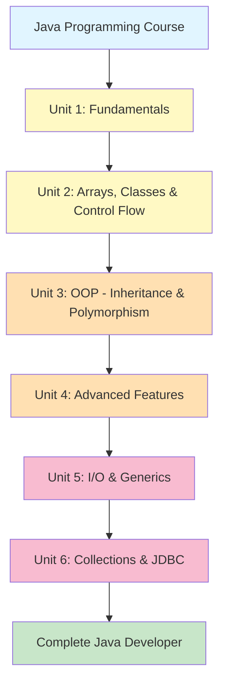

---

## Unit 1: Java Fundamentals

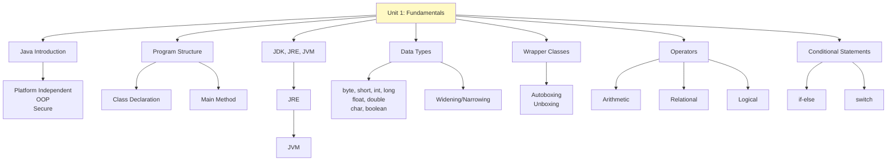

### Unit 1: Flow Diagram

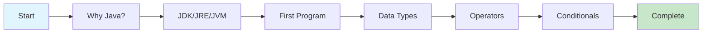

---

## Unit 2: Arrays, Classes & Control Flow

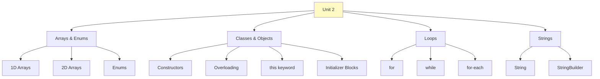

### Unit 2: Execution Order

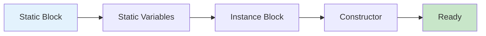

---

## Unit 3: Inheritance, Polymorphism & Abstraction

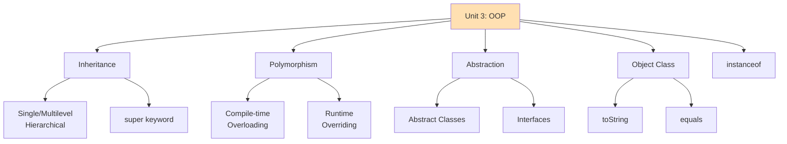

### Inheritance Hierarchy

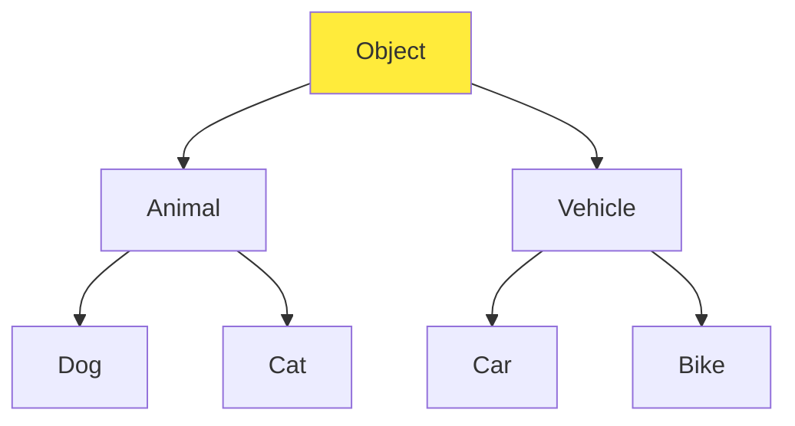

### Polymorphism Flow

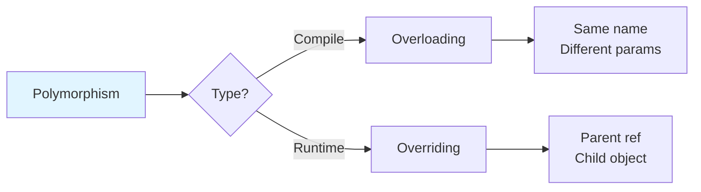

---

## Unit 4: Nested Classes, Lambda & Exception Handling

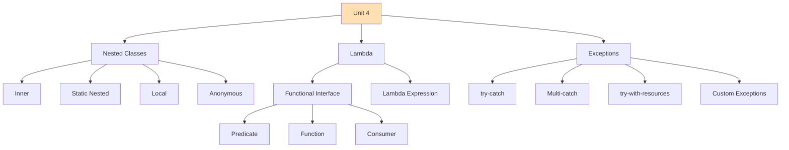

### Exception Handling Flow

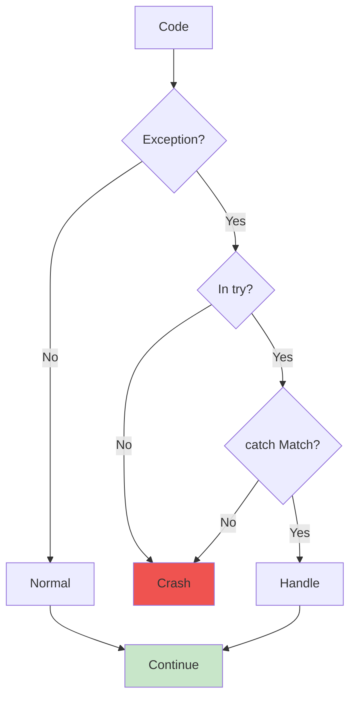

### Lambda Evolution

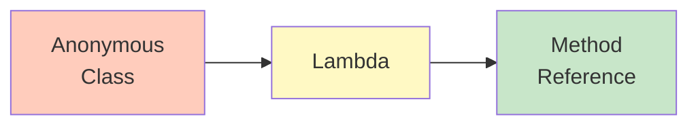

---

## Unit 5: I/O, Serialization & Generics

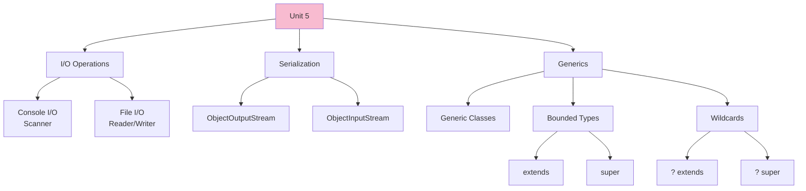

### File I/O Flow

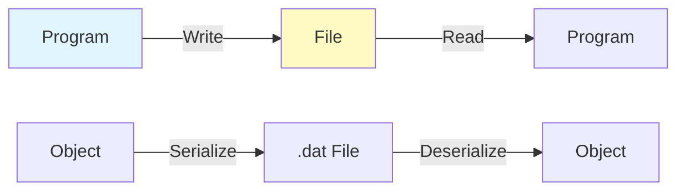

### Generic Bounds

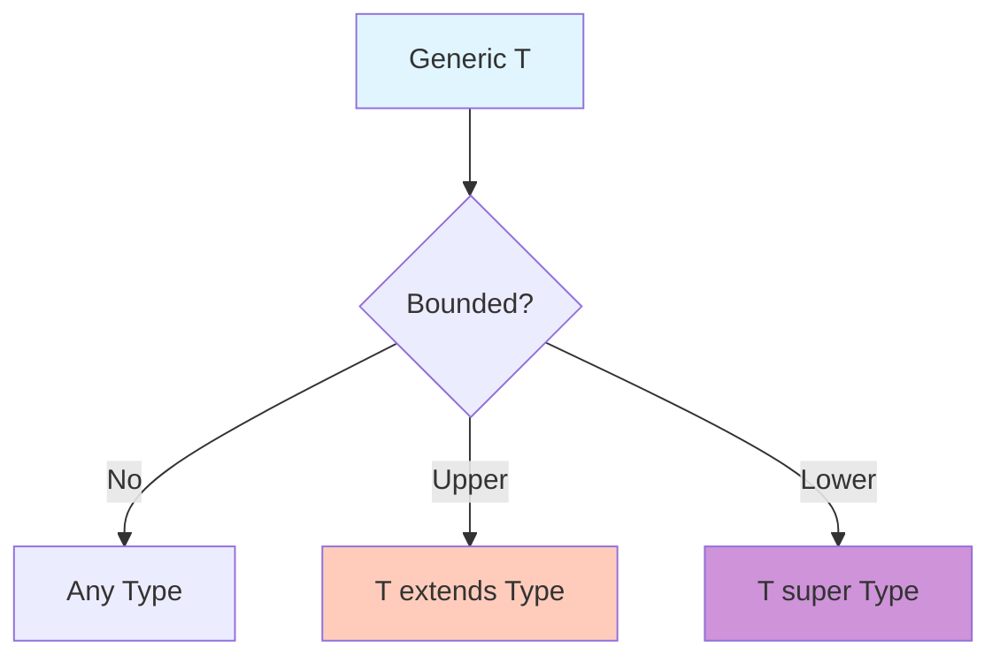

---

## Unit 6: Collections & JDBC

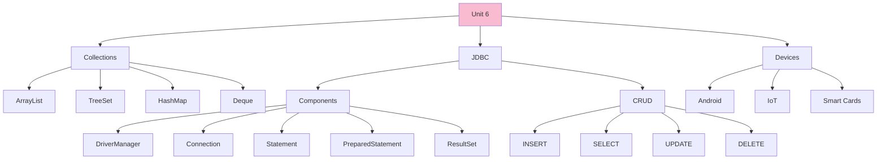

### Collections Hierarchy

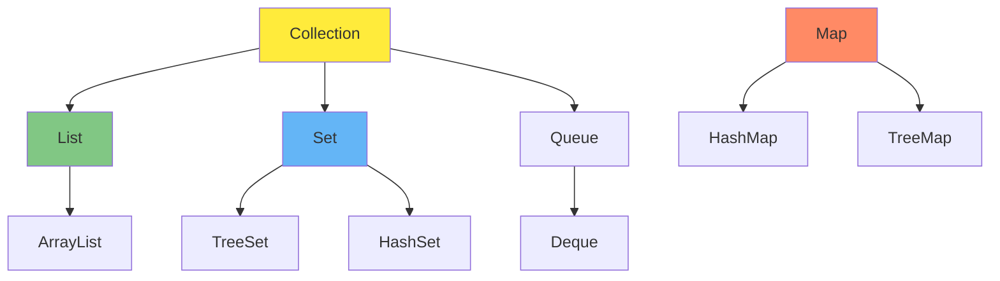

### JDBC Architecture

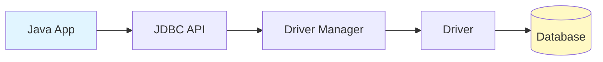

### CRUD Flow

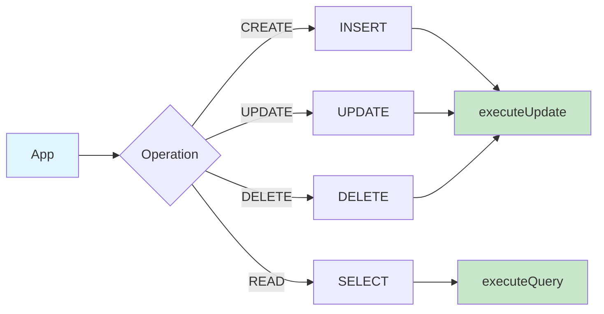

---

## Complete Learning Path

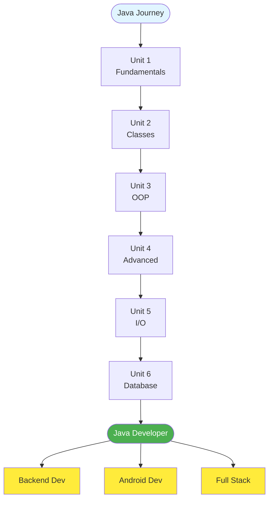

---

## Topic Dependencies

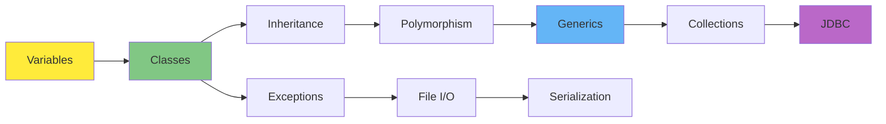

---

## Skill Progression

```mermaid
gantt
    title Java Learning Timeline
    dateFormat X
    axisFormat %s
    
    section Beginner
    Syntax & Basics           :0, 2
    Data Types                :2, 2
    Control Flow              :4, 2
    
    section Intermediate
    Classes & Objects         :6, 3
    Inheritance               :9, 3
    Arrays & Strings          :12, 2
    
    section Advanced
    Exception Handling        :14, 2
    Collections               :16, 3
    Generics                  :19, 2
    
    section Expert
    Lambda & Streams          :21, 2
    File I/O                  :23, 2
    JDBC & Database           :25, 3
```

---

## Key Concepts Map

```mermaid
mindmap
  root((Java))
    Basics
      Syntax
      Data Types
      Operators
    OOP
      Classes
      Inheritance
      Polymorphism
      Abstraction
    Advanced
      Generics
      Lambda
      Exceptions
    Collections
      ArrayList
      HashMap
      TreeSet
    Database
      JDBC
      CRUD
```

---

## Learning Milestones

```mermaid
flowchart LR
    A[Beginner] -->|Units 1-2| B[Intermediate]
    B -->|Unit 3| C[OOP Expert]
    C -->|Units 4-5| D[Advanced]
    D -->|Unit 6| E[Professional]
    
    style A fill:#e1f5ff
    style E fill:#4caf50,color:#fff
```

---

## Summary: Course Structure

```mermaid
graph TB
    subgraph "Foundation"
        A1[Syntax]
        A2[Data Types]
        A3[Classes]
    end
    
    subgraph "OOP"
        B1[Inheritance]
        B2[Polymorphism]
        B3[Abstraction]
    end
    
    subgraph "Modern Java"
        C1[Lambda]
        C2[Generics]
        C3[Collections]
    end
    
    subgraph "Integration"
        D1[File I/O]
        D2[JDBC]
    end
    
    A1 --> A3
    A3 --> B1
    B1 --> B2
    B2 --> C1
    C1 --> C2
    C2 --> C3
    C3 --> D1
    D1 --> D2
    
    style A1 fill:#fff9c4
    style B1 fill:#ffe0b2
    style C1 fill:#f8bbd0
    style D2 fill:#4caf50,color:#fff
```

---

## Career Paths After Completion

```mermaid
graph TD
    Java[Java Developer] --> Path1[Backend Developer]
    Java --> Path2[Android Developer]
    Java --> Path3[Full Stack Developer]
    Java --> Path4[Software Engineer]
    Java --> Path5[DevOps Engineer]
    
    Path1 --> Tech1[Spring Boot<br/>Microservices]
    Path2 --> Tech2[Kotlin<br/>Android Studio]
    Path3 --> Tech3[JavaScript<br/>React/Angular]
    Path4 --> Tech4[System Design<br/>Algorithms]
    Path5 --> Tech5[CI/CD<br/>Cloud]
    
    style Java fill:#4caf50,color:#fff
    style Path1 fill:#ffeb3b
    style Path2 fill:#ffeb3b
    style Path3 fill:#ffeb3b
    style Path4 fill:#ffeb3b
    style Path5 fill:#ffeb3b
```
